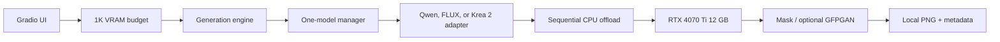

# Architecture

The Gradio UI creates a `GenerationRequest`. The engine derives and then constrains output dimensions, normalizes references, obtains one lazy-loaded adapter, runs inference, optionally composites a mask and restores faces, and saves local PNG files with non-sensitive metadata.

## Memory policy

The key constraint is peak VRAM, not model file size. Pipelines load lazily and only one adapter exists at a time. Sequential CPU offload moves module layers between 64 GB system RAM and the GPU as needed. VAE slicing and tiling reduce encode/decode peaks, attention slicing reduces attention workspace, and each output is generated separately. Switching models destroys the active pipeline, runs garbage collection, and clears the CUDA allocator.

The engine enforces both a longest-side limit and a total-pixel limit after calculating the requested aspect ratio. Edit, reference-edit, and swap workflows default to 1024 pixels and 1,048,576 pixels. **Combine images** and **Create from text** share a separate 2048-pixel/4,194,304-pixel ceiling so their 1K/2K and 1:1/9:16/16:9 canvas choices reach inference without raising limits for other workflows.

## Model layer

`photo_edit_studio/models/registry.py` contains model metadata, task type, and hardware guidance. `diffusers_adapters.py` performs local-only loading and filters call arguments against the installed pipeline signature. Krea 2 has a dedicated text-to-image adapter that never supplies edit images. `memory.py` owns allocator, offload, tiling, slicing, and CUDA-release behavior. Rapid AIO replaces the official Qwen transformer while retaining official tokenizer, text encoder, VAE, and scheduler components.

FLUX.2 Klein 4B has a model-specific load override. It constructs `Qwen3ForCausalLM` from the local GGUF while using Klein's local text-encoder configuration, injects that module into `Flux2KleinPipeline`, and then applies the normal sequential offload policy. FireRed uses a separate project-managed ComfyUI-GGUF graph with a Q4_K_M transformer, FP8 Qwen2.5-VL encoder, and automatic Lightning v1.2 LoRA; the backend starts in low-VRAM mode.

Qwen Image 2.1 runs through a separate ComfyUI 0.37+ API graph: INT8 model/vision encoder, upstream Viggle `ViggleTurboLora` (unmerged rank 256), and `ViggleTurboSigmas` (six raw nodes shifted for the requested output latent). The adapter reuses the same graph for text, editing, combination and two-image instruction-based Head/Body swaps. On the 12 GB target, weights and KV cache require ComfyUI `--lowvram` CPU offload; 2K may exhaust VRAM. It does not load Qwen 2511 BFS LoRAs or the full BF16 Qwen 2.1 snapshot.

The BFS swap section uses the same local generation engine, dimensions cap, metadata and progress. Qwen/Flux reuse the local adapters with a required compatible BFS LoRA and an ordered body/scene then face/head reference pair. Krea swap routes to a **local ComfyUI** API workflow with the upstream `comfyui-krea2edit` nodes; Diffusers `Krea2Pipeline` remains text-only. The bridge is opt-in and errors if the API workflow or ComfyUI is unavailable. Details in `docs/SWAP.md`.

Krea creation, reference editing, and swaps use the same loopback-only ComfyUI bridge with separate built-in API graphs. Every graph inserts the mandatory Krea adapter immediately after `UNETLoader`, before identity-edit, BFS, or optional LoRAs. Reference images are supplied to both the Krea2Edit image-grounded text encoder and model patch's latent path; a disconnected second reference is rejected. When enabled, a project-managed `ComfyUI/main.py` subprocess starts on demand from the same `.venv`; it is not embedded into Gradio's Python process.

## Privacy

Runtime loading uses local snapshots. Prompts and inputs stay in process memory and are excluded from output metadata. Gradio binds to loopback, disables analytics, and does not create a share URL by default.
